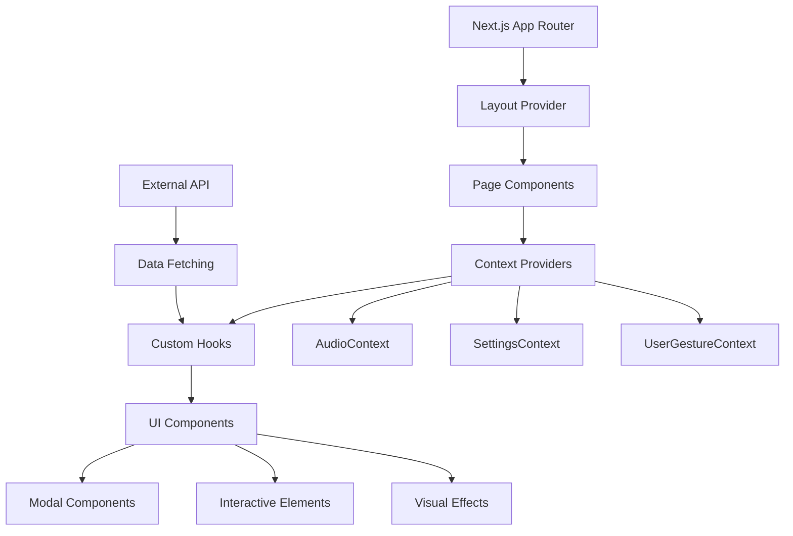
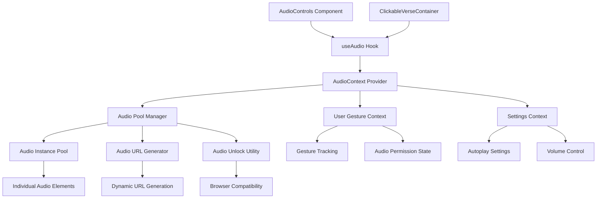

# System Patterns: Luminous Verses

## Architecture Overview

Luminous Verses follows a **modern React architecture** built on Next.js App Router with a focus on component modularity, context-driven state management, and beautiful UI patterns.



## Core Design Patterns

### 1. Context Provider Pattern
**State Management Architecture**
```typescript
// Pattern: Centralized context providers
- AudioContext: Audio playback state and controls
- SettingsContext: User preferences and configuration
- UserGestureContext: User interaction tracking for audio unlock
```

**Benefits:**
- Clean separation of concerns
- Global state accessibility
- Prevents prop drilling
- Encapsulates complex logic

### 2. Custom Hooks Pattern
**Reusable Logic Abstraction**
```typescript
// Pattern: Hook-based business logic
- useAudio: Audio playback management
- useAutoplay: Sequential verse playback automation
- useSurahDescription: Quran metadata fetching
- useSurahs: Surah list data management (in SurahListModal)
- useVerses: Individual verse data fetching
```

**Benefits:**
- Logic reusability across components
- Testable business logic
- Clean component interfaces
- Easier maintenance

### 3. Modal-Based Navigation
**User Flow Architecture**
```typescript
// Pattern: Overlay-based exploration with floating navigation
Landing Page (VerseOfTheDay) 
  → SurahListModal (Surah selection)
    → DetailView (Individual verses)
      → Floating Back Button (halfway down screen)
```

**Enhanced Navigation Features:**
- **Floating Back Button**: Research-based positioning at screen center-left
- **State Persistence**: Modal maintains exact state across close/reopen cycles
- **Backdrop Click**: Natural click-outside-to-close behavior
- **Clean Interface**: Headerless design with more content space
- **Accessibility**: WCAG-compliant touch targets and keyboard navigation

**Benefits:**
- Maintains context during exploration
- Mobile-friendly navigation with modern UX patterns
- Progressive disclosure of information
- Spiritual focus preservation
- Intuitive interaction patterns following modern app conventions

### 4. Component Composition Pattern
**UI Building Blocks**
```typescript
// Pattern: Modular, reusable components
- VerseOfTheDay: Daily inspiration display
- SurahListModal: Quran navigation
- SurahDescriptionHeader: Enhanced Surah metadata display
- AudioControls: Playback interface
- ClickableVerseContainer: Interactive verse display
- SettingsButton: Settings access with glass morphism design
- SettingsModal: Settings configuration with React Portal
- AutoplayManager: Autoplay coordination component
- Visual Effects: Stars, FloatingOrbs, animations
```

### 5. Glass Morphism Design System
**Visual Consistency Pattern**
```css
// Pattern: Unified visual language
.glass-morphism: Semi-transparent surfaces with backdrop blur
.glass-morphism-dark: Darker variant for modals
.text-gradient-gold: Consistent typography treatment
.bg-desert-night: Cosmic background theming
```

## API Integration Patterns

### 1. External Data Source
**Quran API Integration**
- Primary: `https://luminous-verses-api-tan.vercel.app/api/v1/`
- Endpoints: `/get-metadata`, `/get-verses`
- Fallback data for offline scenarios
- Error handling with user-friendly messages

### 2. Progressive Data Loading
**Performance Optimization**
```typescript
// Pattern: Lazy loading with fallbacks
1. Load Surah list on demand
2. Fetch verses only when Surah selected
3. Provide cached translations for popular verses
4. Graceful degradation for API failures
```

## Audio Architecture Patterns

### 1. Comprehensive Audio System Architecture
**Multi-Layer Audio Management**


### 2. Audio Context Provider Pattern
**Centralized Audio State Management**
```typescript
// Pattern: Global audio state with local controls
AudioContext: {
  - currentAudio: Audio instance tracking
  - isPlaying: Playback state
  - isLoading: Loading state management
  - error: Error state handling
  - volume: Volume control
  - playAudio: Playback initiation
  - pauseAudio: Playback control
  - stopAudio: Complete stop with cleanup
}
```

### 3. Audio Pool Management Pattern
**Performance-Optimized Audio Handling**
```typescript
// Pattern: Efficient resource management
AudioPoolManager: {
  - Pool-based audio instance reuse
  - Automatic cleanup of unused instances
  - Memory-efficient audio loading
  - Cross-browser compatibility handling
  - Error recovery and retry mechanisms
}
```

### 4. User Gesture Context Pattern
**Browser Policy Compliance**
```typescript
// Pattern: Audio unlock requirement handling
UserGestureContext: {
  - hasUserGesture: Permission tracking
  - unlockAudio: Browser audio unlock
  - iOS Safari specific handling
  - Touch/click gesture detection
  - Audio context state management
}
```

### 5. Audio URL Generation Pattern
**Dynamic Audio Source Management**
```typescript
// Pattern: Flexible audio source handling
AudioURLGenerator: {
  - Dynamic URL construction for verses
  - Fallback URL strategies
  - Reciter selection support
  - Quality/format optimization
  - CDN and caching considerations
}
```

### 6. Component Integration Pattern
**Audio-Enabled UI Components**
```typescript
// Pattern: Audio integration in UI components
AudioControls: Global playback controls
ClickableVerseContainer: Verse-specific audio triggers
useAudio Hook: Reusable audio logic abstraction
Settings Integration: User preference management
```

### 7. Audio Lifecycle Management
```typescript
// Pattern: Complete audio lifecycle control
Initialization → User Gesture → Audio Unlock → Pool Setup → Playback → Cleanup
     ↓              ↓              ↓            ↓          ↓         ↓
Context Setup → Permission → Browser Unlock → Instance → Controls → Memory
```

### 8. Error Handling and Recovery Pattern
**Robust Audio Error Management**
```typescript
// Pattern: Comprehensive error handling
- Network failure recovery with retry logic
- Browser compatibility fallbacks
- User-friendly error messaging
- Graceful degradation for audio failures
- Automatic cleanup on errors
```

### 9. Autoplay System Pattern
**Intelligent Sequential Playback**
```typescript
// Pattern: Event-driven autoplay with smart controls
useAutoplay: {
  - Audio 'ended' event listener setup
  - Next verse calculation with surah metadata
  - Manual pause detection to prevent unwanted autoplay
  - Event deduplication to prevent duplicate processing
  - Performance optimization with stable dependencies
  - End-of-surah handling with graceful stopping
}

AutoplayManager: {
  - Coordinates autoplay functionality across components
  - Integrates with existing audio system seamlessly
  - Provides clean separation of concerns
  - Manages autoplay state and user preferences
}
```

### 10. Settings System Pattern
**User Preference Management**
```typescript
// Pattern: Modal-based settings with persistent storage
SettingsButton: {
  - Glass morphism design consistent with app theme
  - Accessible gear icon with hover animations
  - Strategic positioning in UI layout
  - Keyboard navigation support
}

SettingsModal: {
  - React Portal implementation for proper z-index
  - Accessibility features (ARIA labels, focus management)
  - Toggle switches for user preferences
  - Settings persistence through SettingsContext
  - Smooth animations and backdrop blur
}

Settings Integration: {
  - Autoplay toggle with immediate effect
  - Translation display preferences
  - Transliteration display options
  - Local storage persistence
  - Context-based state management
}
```

### 11. Manual Stop Detection Pattern
**Preventing Unwanted Autoplay**
```typescript
// Pattern: Distinguishing natural vs manual audio stops
AudioContext Enhancement: {
  - isManuallyStoppedRef flag for tracking stop source
  - Enhanced pause(), stop(), and seek() functions
  - Conditional 'ended' event emission
  - Proper cleanup and state reset
}

Event Flow Control: {
  - Natural verse completion → emit 'ended' → trigger autoplay
  - Manual pause/stop → suppress 'ended' → no autoplay
  - User resume → normal playback continues
  - Error conditions → proper cleanup and reset
}
```

### 12. Floating Navigation Pattern
**Modern Modal UX with Research-Based Design**
```typescript
// Pattern: Floating navigation elements with accessibility
Floating Back Button: {
  - Position: fixed left-8 top-1/2 -translate-y-1/2 (halfway down screen)
  - Default State: opacity-30 text-gray-400 bg-gray-500/20 (subtle, non-intrusive)
  - Interactive State: opacity-100 text-gold bg-gold/20 (prominent when needed)
  - Touch Target: 48x48px minimum for WCAG compliance
  - Animation: smooth slide-left effect on hover/focus
  - Visibility: conditional rendering (only in detail view)
}

Backdrop Click Implementation: {
  - Modal Container: onClick={onClose} for click-outside-to-close
  - Modal Content: onClick={e => e.stopPropagation()} to prevent unwanted closes
  - Event Hierarchy: proper event bubbling and stopping
  - User Experience: follows expected modal interaction patterns
}

State Persistence Architecture: {
  - Problem: Modal reset to list view on every open
  - Solution: Remove state reset logic from useEffect cleanup
  - Preserved State: currentView, selectedSurah, description expanded state
  - User Benefit: Pick up exactly where they left off
  - Modern App Behavior: Consistent with user expectations
}

Clean Interface Design: {
  - Header Removal: Eliminated cluttered header section
  - Content Optimization: Full modal height utilization (max-h-[90vh])
  - Title Integration: Centered title within scrollable content
  - Space Efficiency: More room for actual content consumption
}
```

### 13. Research-Driven UX Pattern
**Evidence-Based Design Implementation**
```typescript
// Pattern: MCP-assisted research and implementation
Research Phase: {
  - Context7 MCP: Studied Ant Design X modal patterns and components
  - Perplexity Research MCP: Analyzed floating navigation best practices
  - Key Findings: position: fixed for visibility, 44x44px touch targets, backdrop patterns
  - Implementation: Applied research findings to actual code
}

Accessibility Compliance: {
  - Touch Targets: 48x48px minimum size (WCAG guidelines)
  - ARIA Labels: Proper screen reader support
  - Keyboard Navigation: Full keyboard accessibility
  - Focus Management: Proper focus states and transitions
  - Color Contrast: Sufficient contrast ratios for visibility
}

Modern UX Patterns: {
  - Floating Elements: Non-intrusive but accessible navigation
  - State Persistence: App-like behavior across sessions
  - Backdrop Interactions: Expected modal closing behavior
  - Progressive Disclosure: Clean interface with contextual controls
}
```

## State Management Patterns

### 1. Local vs Global State
**Strategic State Placement**
- **Global**: Audio state, user settings, gesture permissions
- **Local**: Modal visibility, loading states, temporary UI state
- **Derived**: Computed values from API responses

### 2. Data Flow Architecture
```typescript
// Pattern: Unidirectional data flow
API Response → Custom Hook → Context → Component → UI Update
     ↑                                                    ↓
Error Handling ← ← ← ← ← ← ← ← ← ← ← ← ← ← User Interaction
```

## Visual Design Patterns

### 1. Cosmic Theme System
**Consistent Visual Language**
- Deep space gradient backgrounds
- Twinkling star animations
- Floating orb ambient effects
- Golden accent color (#FBB024)
- Glass morphism surfaces

### 2. Typography Hierarchy
**Multi-lingual Text System**
- **Arabic**: Amiri font for authentic Quranic text
- **UI Text**: Geist Sans for modern readability
- **Code**: Geist Mono for technical elements
- **Responsive**: Adaptive sizing across devices

### 3. Animation Philosophy
**Gentle, Spiritual Movements**
- Fade-in transitions for contemplative pacing
- Subtle floating animations for ambient effect
- Smooth modal transitions preserving context
- No jarring movements that break spiritual mood

## Performance Patterns

### 1. Component Optimization
**React Performance Best Practices**
- Lazy loading of heavy components
- Memoization for expensive calculations
- Efficient re-render prevention
- Bundle splitting for code organization

### 2. Audio Performance
**Optimized Playback Management**
- Audio pool pattern for memory efficiency
- Preloading strategies for smooth playback
- Cleanup patterns for resource management
- Browser compatibility handling

## Security & Privacy Patterns

### 1. Data Protection
**User Privacy Respect**
- No user data collection without consent
- Local storage for user preferences
- Secure API communication patterns
- Child-safe content delivery

### 2. Content Integrity
**Sacred Text Handling**
- Authentic Arabic text preservation
- Verified translation sources
- Respectful presentation of religious content
- Cultural sensitivity in design choices

## Development Patterns

### 1. TypeScript Integration
**Type Safety Throughout**
- Strict typing for API responses
- Interface definitions for all data structures
- Type-safe context implementations
- Component prop validation

### 2. Error Boundary Strategy
**Graceful Failure Handling**
- API fallback mechanisms
- User-friendly error messages
- Retry functionality for temporary failures
- Offline mode capabilities

This architecture supports the spiritual mission of Luminous Verses while maintaining modern web development standards and ensuring a beautiful, performant user experience for children and families.