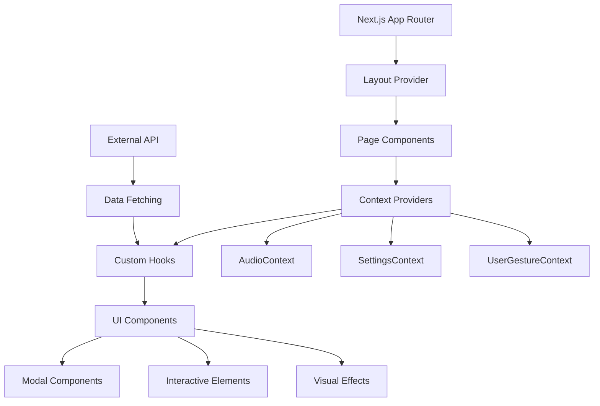

# System Patterns: Luminous Verses

## Architecture Overview

Luminous Verses follows a **modern React architecture** built on Next.js App Router with a focus on component modularity, context-driven state management, and beautiful UI patterns.



## Core Design Patterns

### 1. Context Provider Pattern
**State Management Architecture**
```typescript
// Pattern: Centralized context providers
- AudioContext: Audio playback state and controls
- SettingsContext: User preferences and configuration
- UserGestureContext: User interaction tracking for audio unlock
```

**Benefits:**
- Clean separation of concerns
- Global state accessibility
- Prevents prop drilling
- Encapsulates complex logic

### 2. Custom Hooks Pattern
**Reusable Logic Abstraction**
```typescript
// Pattern: Hook-based business logic
- useAudio: Audio playback management
- useSurahDescription: Quran metadata fetching
- useSurahs: Surah list data management (in SurahListModal)
- useVerses: Individual verse data fetching
```

**Benefits:**
- Logic reusability across components
- Testable business logic
- Clean component interfaces
- Easier maintenance

### 3. Modal-Based Navigation
**User Flow Architecture**
```typescript
// Pattern: Overlay-based exploration
Landing Page (VerseOfTheDay) 
  → SurahListModal (Surah selection)
    → DetailView (Individual verses)
```

**Benefits:**
- Maintains context during exploration
- Mobile-friendly navigation
- Progressive disclosure of information
- Spiritual focus preservation

### 4. Component Composition Pattern
**UI Building Blocks**
```typescript
// Pattern: Modular, reusable components
- VerseOfTheDay: Daily inspiration display
- SurahListModal: Quran navigation
- AudioControls: Playback interface
- ClickableVerseContainer: Interactive verse display
- Visual Effects: Stars, FloatingOrbs, animations
```

### 5. Glass Morphism Design System
**Visual Consistency Pattern**
```css
// Pattern: Unified visual language
.glass-morphism: Semi-transparent surfaces with backdrop blur
.glass-morphism-dark: Darker variant for modals
.text-gradient-gold: Consistent typography treatment
.bg-desert-night: Cosmic background theming
```

## API Integration Patterns

### 1. External Data Source
**Quran API Integration**
- Primary: `https://luminous-verses-api-tan.vercel.app/api/v1/`
- Endpoints: `/get-metadata`, `/get-verses`
- Fallback data for offline scenarios
- Error handling with user-friendly messages

### 2. Progressive Data Loading
**Performance Optimization**
```typescript
// Pattern: Lazy loading with fallbacks
1. Load Surah list on demand
2. Fetch verses only when Surah selected
3. Provide cached translations for popular verses
4. Graceful degradation for API failures
```

## Audio Architecture Patterns

### 1. Web Audio API Integration
**Advanced Audio Management**
- Audio pool management for performance
- User gesture unlock for browser compatibility
- Context-aware audio state management
- Retry mechanisms for failed audio loads

### 2. Audio Lifecycle Management
```typescript
// Pattern: Centralized audio control
AudioContext → AudioPoolManager → Individual Audio Instances
  ↓
User gesture tracking → Audio unlock → Playback permission
```

## State Management Patterns

### 1. Local vs Global State
**Strategic State Placement**
- **Global**: Audio state, user settings, gesture permissions
- **Local**: Modal visibility, loading states, temporary UI state
- **Derived**: Computed values from API responses

### 2. Data Flow Architecture
```typescript
// Pattern: Unidirectional data flow
API Response → Custom Hook → Context → Component → UI Update
     ↑                                                    ↓
Error Handling ← ← ← ← ← ← ← ← ← ← ← ← ← ← User Interaction
```

## Visual Design Patterns

### 1. Cosmic Theme System
**Consistent Visual Language**
- Deep space gradient backgrounds
- Twinkling star animations
- Floating orb ambient effects
- Golden accent color (#FBB024)
- Glass morphism surfaces

### 2. Typography Hierarchy
**Multi-lingual Text System**
- **Arabic**: Amiri font for authentic Quranic text
- **UI Text**: Geist Sans for modern readability
- **Code**: Geist Mono for technical elements
- **Responsive**: Adaptive sizing across devices

### 3. Animation Philosophy
**Gentle, Spiritual Movements**
- Fade-in transitions for contemplative pacing
- Subtle floating animations for ambient effect
- Smooth modal transitions preserving context
- No jarring movements that break spiritual mood

## Performance Patterns

### 1. Component Optimization
**React Performance Best Practices**
- Lazy loading of heavy components
- Memoization for expensive calculations
- Efficient re-render prevention
- Bundle splitting for code organization

### 2. Audio Performance
**Optimized Playback Management**
- Audio pool pattern for memory efficiency
- Preloading strategies for smooth playback
- Cleanup patterns for resource management
- Browser compatibility handling

## Security & Privacy Patterns

### 1. Data Protection
**User Privacy Respect**
- No user data collection without consent
- Local storage for user preferences
- Secure API communication patterns
- Child-safe content delivery

### 2. Content Integrity
**Sacred Text Handling**
- Authentic Arabic text preservation
- Verified translation sources
- Respectful presentation of religious content
- Cultural sensitivity in design choices

## Development Patterns

### 1. TypeScript Integration
**Type Safety Throughout**
- Strict typing for API responses
- Interface definitions for all data structures
- Type-safe context implementations
- Component prop validation

### 2. Error Boundary Strategy
**Graceful Failure Handling**
- API fallback mechanisms
- User-friendly error messages
- Retry functionality for temporary failures
- Offline mode capabilities

This architecture supports the spiritual mission of Luminous Verses while maintaining modern web development standards and ensuring a beautiful, performant user experience for children and families.