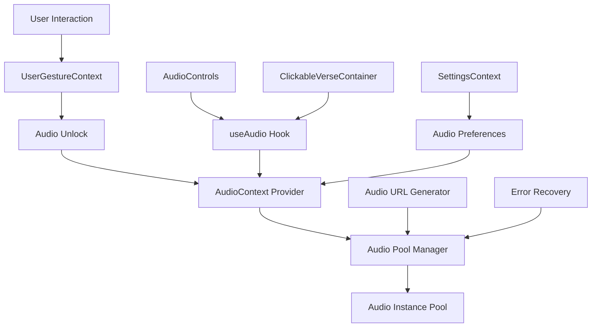

# Technical Context: Luminous Verses

## Technology Stack

### Core Framework
- **Next.js 15.3.3**: React App Router architecture
- **React 19.1.0**: Latest React with concurrent features
- **TypeScript 5.x**: Full type safety throughout the application (Specifically 5.8.3 from package.json)
- **Node.js**: Runtime environment for build and development

### Styling & Design
- **Tailwind CSS 4**: Utility-first CSS framework with latest features
- **PostCSS**: CSS processing pipeline
- **Custom CSS Variables**: Design token system for consistent theming
- **Google Fonts**: Geist Sans, Geist Mono, and Amiri (Arabic) font families

### Development Tools
- **ESLint 9**: Modern linting with Next.js configuration
- **TypeScript**: Strict type checking and IntelliSense
- **VS Code**: Primary development environment
- **Git**: Version control and collaboration

## Architecture Decisions

### Framework Choice: Next.js App Router
**Why Chosen:**
- Server-side rendering for performance and SEO
- App Router provides modern file-based routing
- Built-in optimization for fonts, images, and bundles
- Excellent TypeScript integration
- Strong React 19 support

**Trade-offs:**
- App Router learning curve vs Pages Router
- More complex caching behavior to understand
- Newer pattern with evolving best practices

### Authentication: Stack Auth
**Why Chosen:**
- Modern, secure, and scalable authentication solution
- Easy integration with Next.js App Router
- Supports various authentication methods (email/password, OAuth)
- Provides robust user management features

**Implementation Pattern:**
```typescript
// Stack Auth Integration
src/stack.tsx                 // Stack Auth server-side configuration
src/app/layout.tsx            // Stack Auth Provider integration
src/app/handler/[...stack]/page.tsx // Stack Auth API routes
src/app/components/AuthModal.tsx // Stack Auth UI components
src/app/contexts/AuthContext.tsx // (Removed/Replaced)
```

### State Management: React Context + Custom Hooks
**Why Chosen:**
- Lighter weight than Redux for application scope
- Native React patterns for better tree-shaking
- Excellent TypeScript integration
- Easier testing and debugging

**Implementation Pattern:**
```typescript
// Context providers for global state
AudioContext → Audio playback management
SettingsContext → User preferences
UserGestureContext → Browser audio unlock tracking
StackAuthContext → User authentication state (handled by Stack Auth SDK)

// Custom hooks for business logic
useAudio → Audio control abstraction
useSurahDescription → Quran metadata
```

### Styling: Tailwind CSS 4
**Why Chosen:**
- Utility-first approach for rapid development
- Excellent responsive design utilities
- Built-in design system consistency
- Great development experience with IntelliSense
- Version 4 brings CSS-in-JS performance improvements

**Custom Extensions:**
```css
- Glass morphism utilities (.glass-morphism, .glass-morphism-dark)
- Gradient text utilities (.text-gradient-gold, .text-gradient-purple)
- Custom color palette (desert theme, gold accents)
- Animation utilities (twinkle, float, glow effects)
```

## Audio System Architecture

### Audio Technology Stack
- **Web Audio API**: Advanced audio control and management
- **HTML5 Audio Elements**: Cross-browser audio playback foundation
- **Audio Pool Management**: Custom implementation for performance optimization
- **User Gesture Detection**: Browser policy compliance system

### Audio Implementation Components

#### Core Audio Files
```typescript
// Audio Context Management
src/app/contexts/AudioContext.tsx        // Global audio state provider
src/app/contexts/UserGestureContext.tsx  // Browser gesture tracking
src/app/contexts/SettingsContext.tsx     // Audio preferences

// Audio Utilities
src/app/utils/audioPoolManager.ts        // Audio instance pool management
src/app/utils/audioUnlock.ts             // Browser audio unlock utility
src/app/utils/audioUrlGenerator.ts       // Dynamic audio URL generation

// Audio Hooks
src/app/hooks/useAudio.ts                // Audio control abstraction

// Audio Types
src/app/types/audio.ts                   // TypeScript audio definitions

// Audio Components
src/app/components/AudioControls.tsx     // Global audio controls
src/app/components/ClickableVerseContainer.tsx // Verse audio integration
```

#### Audio Architecture Pattern


### Audio System Features

#### Browser Compatibility
- **iOS Safari Audio Unlock**: Specialized handling for iOS audio restrictions
- **Cross-browser Support**: Chrome, Firefox, Safari, Edge compatibility
- **Mobile Optimization**: Touch gesture detection and audio unlock
- **Progressive Enhancement**: Graceful degradation when audio fails

#### Performance Optimization
- **Audio Pool Management**: Reuse audio instances to prevent memory leaks
- **Lazy Loading**: Audio resources loaded on demand
- **Memory Cleanup**: Automatic cleanup of unused audio instances
- **Error Recovery**: Comprehensive retry mechanisms for failed audio loads

#### User Experience Features
- **Gesture-based Unlock**: Automatic audio unlock on first user interaction
- **Volume Control**: Integrated with settings system
- **Autoplay Settings**: User-configurable autoplay preferences
- **Loading States**: Visual feedback during audio loading
- **Error Handling**: User-friendly error messages and recovery

### Audio URL Generation
```typescript
// Dynamic audio source management
const audioUrl = generateAudioUrl({
  surahNumber: 1,
  verseNumber: 1,
  reciter: 'default',
  quality: 'high'
});
```

### Audio State Management
```typescript
// Global audio state structure
interface AudioState {
  currentAudio: HTMLAudioElement | null;
  isPlaying: boolean;
  isLoading: boolean;
  error: string | null;
  volume: number;
  currentVerse: { surah: number; verse: number } | null;
}
```

## Development Environment

### Project Structure
```
luminous-verses/
├── src/app/                 # Next.js App Router
│   ├── components/         # Reusable UI components
│   ├── contexts/          # React Context providers
│   ├── hooks/             # Custom React hooks
│   ├── utils/             # Utility functions
│   ├── globals.css        # Global styles and design tokens
│   ├── layout.tsx         # Root layout with providers
│   └── page.tsx           # Landing page component
├── memory-bank/           # Project documentation and context
├── public/               # Static assets
└── package.json          # Dependencies and scripts
```

### Build System
- **Build Command**: `next build` - Production optimization
- **Dev Server**: `next dev` - Hot reload development
- **Type Checking**: Integrated TypeScript compilation
- **Linting**: ESLint with Next.js recommended rules

### Package Management
- **pnpm**: Primary package manager
- **Lock File**: pnpm-lock.yaml for consistent installs
- **Scripts**: Standard Next.js development workflow

## External Dependencies

### Core Dependencies
```json
{
  "next": "15.3.3",           // React framework
  "react": "19.1.0",         // UI library
  "react-dom": "19.1.0"      // DOM bindings
}
```

### Development Dependencies
```json
{
  "typescript": "5.8.3",                    // Type safety
  "@types/node": "20.19.0",                  // Node.js types
  "@types/react": "19.1.8",                 // React types
  "@types/react-dom": "19.1.6",             // React DOM types
  "@tailwindcss/postcss": "4.1.10",          // Tailwind integration
  "tailwindcss": "4.1.10",                   // CSS framework
  "eslint": "9.29.0",                        // Code linting
  "eslint-config-next": "15.3.3",       // Next.js ESLint rules
  "@eslint/eslintrc": "3.3.1"               // ESLint configuration
}
```

## API Integration

### Quran Data Source
- **Primary API**: `https://luminous-verses-api-tan.vercel.app/api/v1/`
- **Endpoints Used**:
  - `GET /get-metadata?type=surah-list` - Surah metadata
  - `GET /get-verses?surah={id}&translation=true` - Verse data
  - `GET /user-bookmarks` - User bookmarks functionality (requires authentication)
- **Authentication**: Required for user-bookmarks (Stack Auth JWT)
- **Rate Limiting**: Not specified, handled gracefully
- **Caching Strategy**: Browser-level caching + fallback data

### Data Flow Pattern
```typescript
// API call → Custom hook → Context → Component → UI
fetch(api) → useSurahs() → SurahListModal → UI rendering
```

## Browser Compatibility

### Target Browsers
- **Modern browsers**: Chrome, Firefox, Safari, Edge (latest 2 versions)
- **Mobile browsers**: iOS Safari, Chrome Mobile, Samsung Internet
- **Accessibility**: WCAG 2.1 Level AA compliance targeted

### Progressive Enhancement
- **Core functionality**: Works without JavaScript for basic content
- **Audio features**: Require JavaScript but gracefully degrade
- **Animations**: Respect user motion preferences
- **Offline capability**: Planned for Phase 2

## Performance Considerations

### Bundle Optimization
- **Code splitting**: Automatic with App Router
- **Tree shaking**: Enabled by default
- **Font optimization**: Next.js automatic font optimization
- **Image optimization**: Built-in Next.js image component (when used)

### Runtime Performance
- **React 19 features**: Concurrent rendering for smooth interactions
- **Audio optimization**: Pool management for memory efficiency
- **Animation performance**: CSS transforms and GPU acceleration
- **Memory management**: Proper cleanup in useEffect hooks

## Security & Privacy

### Content Security
- **No user data collection**: Privacy-first approach
- **Local storage only**: User preferences stored locally
- **HTTPS enforcement**: Production deployment security
- **Content integrity**: Verified Quran text sources

### Child Safety
- **Safe content**: Religious educational content only
- **No external links**: Contained learning environment
- **No user-generated content**: Curated experience only
- **Family-friendly**: Appropriate for all ages

## Development Workflow

### Local Development
```bash
# Start development server
pnpm run dev

# Type checking
pnpm tsc --noEmit

# Linting
pnpm run lint

# Production build
pnpm run build
```

### Code Quality
- **TypeScript strict mode**: Enabled for type safety
- **ESLint rules**: Next.js recommended + custom rules
- **File organization**: Feature-based component structure
- **Naming conventions**: Descriptive, TypeScript-friendly names

## Deployment Architecture

### Target Platform
- **Vercel**: Optimized for Next.js applications
- **CDN**: Global edge network for performance
- **Automatic deployments**: Git-based CI/CD
- **Environment variables**: Secure configuration management

### Build Output
- **Static assets**: Optimized for CDN delivery
- **Server functions**: Edge runtime where applicable
- **Bundle analysis**: Performance monitoring built-in

## Known Technical Constraints

### Audio Limitations
- **Browser policies**: Require user gesture for audio playback
- **iOS Safari**: Specific audio unlock requirements
- **Mobile bandwidth**: Consider audio file sizes
- **Offline mode**: Audio files not cached yet

### API Dependencies
- **External API**: Single point of failure for Quran data
- **Rate limiting**: Potential throttling on heavy usage
- **Data freshness**: No real-time updates needed
- **Fallback strategy**: Static data for core verses

## Future Technical Considerations

### Scalability Planning
- **Offline mode**: Service worker for core content
- **Audio caching**: Progressive download of recitations
- **Search functionality**: Full-text search implementation
- **User accounts**: Optional user data synchronization

### Monitoring & Analytics
- **Performance monitoring**: Core Web Vitals tracking
- **Error tracking**: Production error monitoring
- **Usage analytics**: Privacy-compliant user engagement
- **A/B testing**: Feature optimization framework

This technical foundation supports the spiritual mission while ensuring modern web standards, performance, and maintainability.